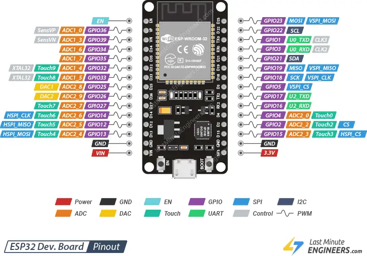
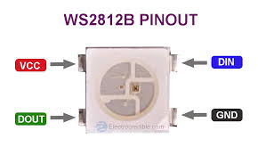
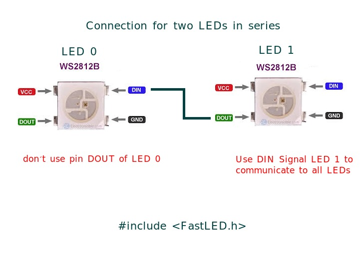
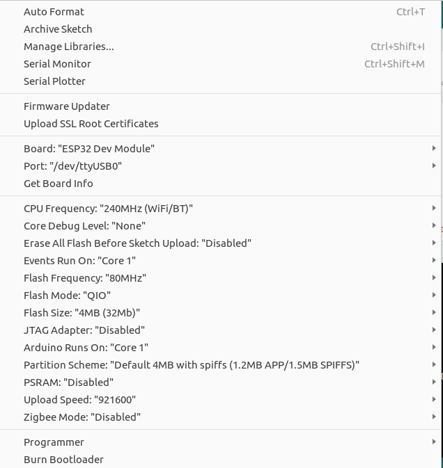
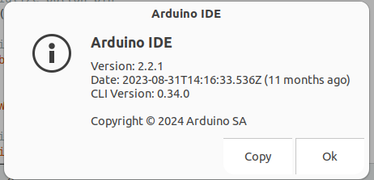
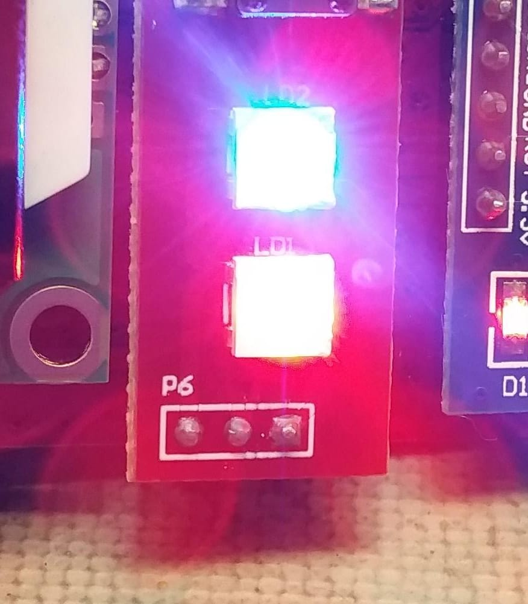
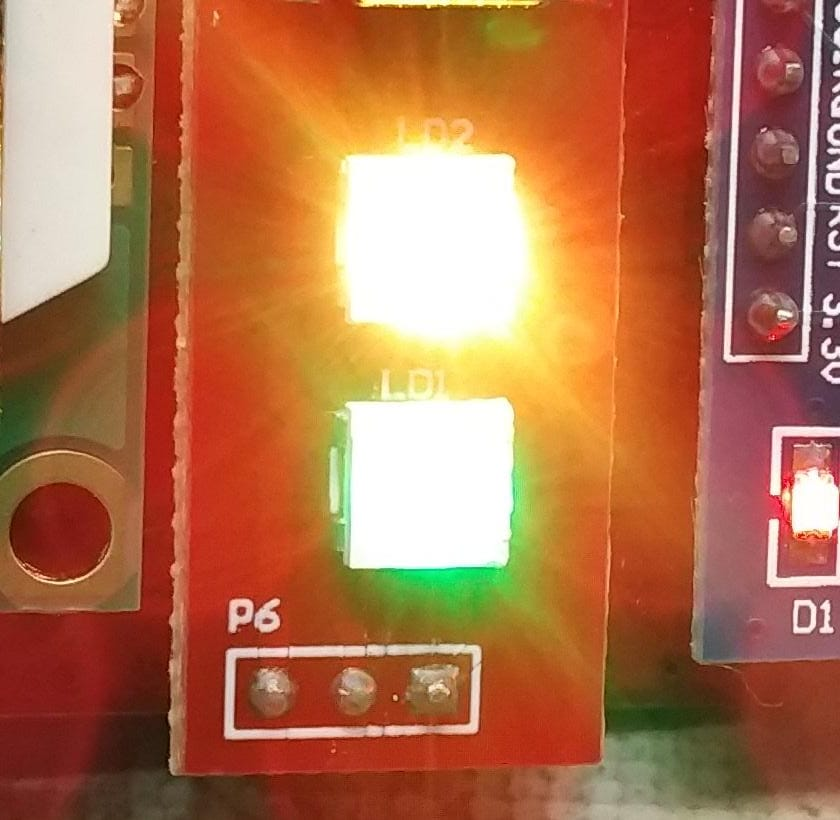

# ESP32 with WS2812B RGB LED

This project demonstrates how to control WS2812B RGB LEDs using an ESP32 board with Arduino. The provided code allows you to manipulate LED colors and effects using the FastLED library.

## 📌 Features
- Controls WS2812B RGB LEDs using an ESP32 microcontroller.
- Implements various LED effects and animations.
- Uses the FastLED library for efficient LED handling.
- Works with the Arduino IDE.

## 🛠️ Installation

### 1. Install Arduino IDE
Download and install the **Arduino IDE** from [here](https://www.arduino.cc/en/software).

### 2. Install ESP32 Board Support
1. Open **Arduino IDE** and go to `File > Preferences`.
2. Add the following URL to **Additional Board Manager URLs**:
   ```
   https://raw.githubusercontent.com/espressif/arduino-esp32/gh-pages/package_esp32_index.json
   ```
3. Go to `Tools > Board > Boards Manager` and search for **ESP32 by Espressif Systems**.
4. Click **Install**.

### 3. Install Required Libraries
Go to `Sketch > Include Library > Manage Libraries` and install:
- **FastLED** library

### 4. Upload the Code
1. Open `arduino_code_WS2812B.ino` in Arduino IDE.
2. Select the correct board and port (`Tools > Board > ESP32 Dev Module`).
3. Click the **Upload** button.

## 🚀 Usage

### Running the LED Animation
1. Connect your ESP32 to the WS2812B LED strip.
2. Power on the ESP32 and observe the LED effects.

### Example Code Snippet
```cpp
#include <FastLED.h>
#define LED_PIN 5
#define NUM_LEDS 10

CRGB leds[NUM_LEDS];

void setup() {
    FastLED.addLeds<WS2812, LED_PIN, GRB>(leds, NUM_LEDS);
    FastLED.clear();
    FastLED.show();
}

void loop() {
    for(int i = 0; i < NUM_LEDS; i++) {
        leds[i] = CRGB::Red;
        FastLED.show();
        delay(100);
        leds[i] = CRGB::Black;
    }
}
```

## 📂 Folder Structure

```
ESP32_with_LED_RGB_WS2812B/
│── arduino_code_WS2812B.ino      # Arduino sketch file
│── 2_LEDs_in_series.jpeg         # Circuit diagram for LED connection
│── WS2812B_pinout.jpeg           # Pinout reference for WS2812B LEDs
│── Arduino_ESP32_config.png      # Arduino IDE setup guide
│── ESP32_pinout.png              # Pinout diagram for ESP32
│── README.md                     # Project documentation
```

## 📷 Images

### ESP32 Pinout


### WS2812B Pinout


### LED Wiring Diagram (2 LEDs in Series)


### Arduino ESP32 Board Configuration


### Arduino IDE Version


### Arduino Code Example Preview



## ⚙️ Configuration
- **LED_PIN**: GPIO pin used to control WS2812B LEDs (default: **5**).
- **NUM_LEDS**: Number of LEDs in the strip (adjust as needed).

## 🤝 Contributing
Feel free to open issues or submit pull requests.
